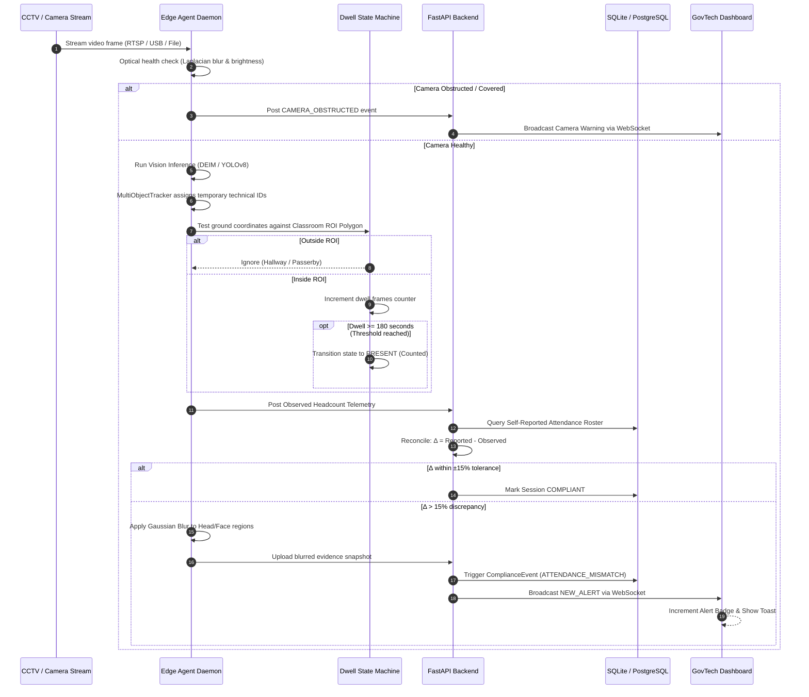
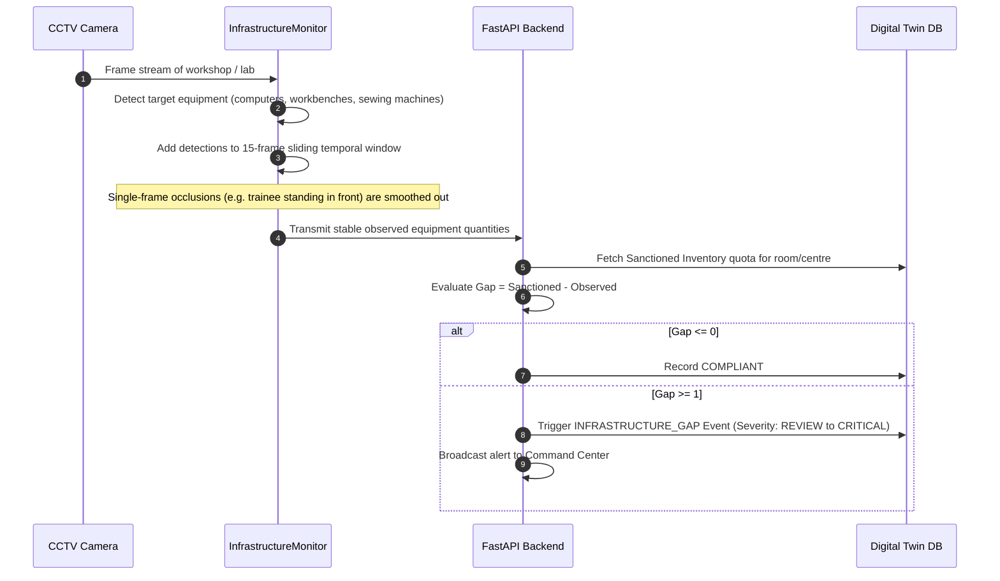
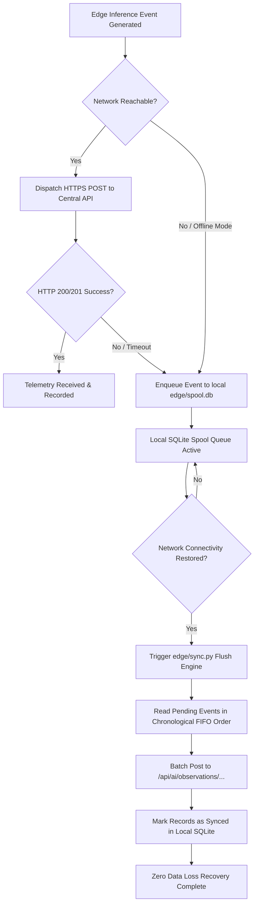
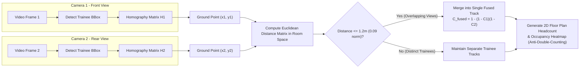
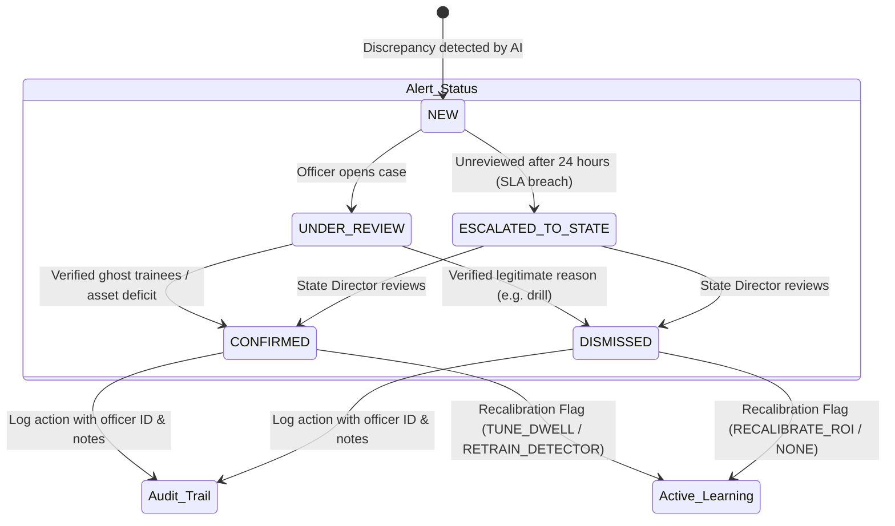
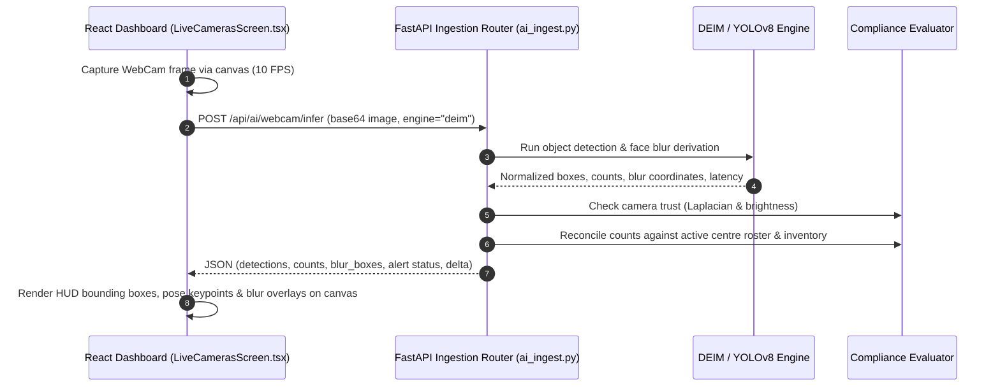

# 🇮🇳 CentreWatch AI — Comprehensive System Working, Features, and Architecture Flow
### Ministry of Skill Development and Entrepreneurship (MSDE) | Problem Statement 26245
> **Privacy-Preserving, Low-Bandwidth Edge AI Monitoring Platform for Distributed Vocational & PMKVY Training Centres**

---

## 📑 Table of Contents
1. [Executive Summary & Problem Statement](#1-executive-summary--problem-statement)
2. [End-to-End System Architecture](#2-end-to-end-system-architecture)
3. [Comprehensive Feature Catalog](#3-comprehensive-feature-catalog)
4. [Step-by-Step Operational Flows & Diagrams](#4-step-by-step-operational-flows--diagrams)
   - [Flow 1: Attendance Verification & Discrepancy Pipeline](#flow-1-attendance-verification--discrepancy-pipeline)
   - [Flow 2: Physical Infrastructure & Asset Monitoring Pipeline](#flow-2-physical-infrastructure--asset-monitoring-pipeline)
   - [Flow 3: Low-Bandwidth Edge Spooling & Resilient Sync Pipeline](#flow-3-low-bandwidth-edge-spooling--resilient-sync-pipeline)
   - [Flow 4: Multi-Camera Spatial Ground-Plane Fusion Pipeline](#flow-4-multi-camera-spatial-ground-plane-fusion-pipeline)
   - [Flow 5: Alert Adjudication, Active Learning & SLA Escalation](#flow-5-alert-adjudication-active-learning--sla-escalation)
   - [Flow 6: In-Browser WebCam & RTSP Live Inference Pipeline](#flow-6-in-browser-webcam--rtsp-live-inference-pipeline)
5. [Mathematical & Algorithmic Foundations](#5-mathematical--algorithmic-foundations)
6. [Repository Codebase & File Mapping](#6-repository-codebase--file-mapping)
7. [Empirical Benchmark Results & Evaluation](#7-empirical-benchmark-results--evaluation)
8. [Setup & Live Demonstration Instructions](#8-setup--live-demonstration-instructions)

---

## 1. Executive Summary & Problem Statement

### 1.1 The Context (PS 26245)
Under the **Ministry of Skill Development and Entrepreneurship (MSDE)** and schemes like **PMKVY (Pradhan Mantri Kaushal Vikas Yojana)**, thousands of vocational training centres operate across India. Ensuring genuine trainee attendance and verified physical training infrastructure (computers, sewing machines, automotive workbenches) is critical to preventing fraudulent subsidy claims ("ghost trainees") and ensuring high-quality skilling.

### 1.2 Conventional Flaws vs. CentreWatch AI Solution

| Challenge | Conventional Flawed Approach | CentreWatch AI Solution |
| :--- | :--- | :--- |
| **Attendance Verification** | Biometric Facial Recognition (Privacy violations, illegal under India's **DPDP Act 2023** for youth). | **Privacy-Preserving Presence Intelligence:** YOLOv8/DEIM person localization + ByteTrack temporal tracking + 180s classroom ROI dwell state machine. **Zero facial recognition.** |
| **Bandwidth Limits** | Continuous 1080p CCTV streaming ($>2\text{ Mbps}$ per camera, unaffordable and unreliable in rural centres). | **Edge Inference + Lightweight Telemetry:** Inference runs locally at the centre. Only structured JSON telemetry ($\approx 1.8\text{ KB/min}$) leaves the site (**99.8% bandwidth savings**). |
| **Network Outages (2G/3G)** | Connection drops cause monitoring blackouts and lost attendance records. | **Edge SQLite Spool Buffer:** Outages automatically spool events into a local SQLite queue (`edge/spool.db`) and flush chronologically upon link recovery. |
| **Physical Equipment Fraud** | Yearly manual inspections that can be gamed by temporarily renting equipment. | **Continuous Multi-Frame Asset Monitoring:** Sliding-window temporal aggregation tracking computers, workbenches, and tools against sanctioned quotas. |
| **Multi-Camera Overlap** | Multiple cameras in a large lab cause severe double-counting. | **Multi-Camera Ground-Plane Fusion:** Homography perspective projection to 2D floor coordinates with spatial clustering ($\sim 1.2\text{m}$ radius). |
| **Camera Tampering / Obstruction** | Covered or blinded cameras trigger false absence penalties. | **Camera Trust Reasoner:** Optical analysis (Laplacian variance, brightness, contrast) flags `CAMERA_OBSTRUCTED` rather than penalizing centres unfairly. |
| **Dispute Resolution** | Automated opaque penalties without recourse. | **Human-in-the-Loop Adjudication:** Monitoring officers review Gaussian-blurred evidence snapshots, deltas, and notes with an immutable cryptographic audit log. |

---

## 2. End-to-End System Architecture

> 💡 **Presentation Architecture Slide Assets for SIH PPT:**
> - **Studio-Grade Vector SVG (100% Crisp, Import & Convert to Shape in PowerPoint):** [docs/architecture_diagram.svg](file:///c:/Shashank/Hackathon/SIH/SIH26245/first/docs/architecture_diagram.svg)
> - **Interactive 16:9 Presentation HTML Slide:** [docs/architecture_diagram.html](file:///c:/Shashank/Hackathon/SIH/SIH26245/first/docs/architecture_diagram.html)
> - **High-Resolution Slide Image (16:9 JPG):** [docs/sih_clear_architecture_diagram.jpg](file:///c:/Shashank/Hackathon/SIH/SIH26245/first/docs/sih_clear_architecture_diagram.jpg)

```text
[ CCTV / RTSP / IP Camera / USB WebCam ]
                   │
                   ▼ (Raw video frames remain 100% local)
┌────────────────────────────────────────────────────────────────────────┐
│ 1. EDGE AI AGENT DAEMON (edge/agent.py & ai/inference.py)              │
│  ├── Vision Engines:                                                   │
│  │    ├── DEIM (CVPR 2025 Real-Time DETR, HGNetv2 backbone, NMS-free)  │
│  │    └── YOLOv8 + Pose (Anchor-free CNN + 17-Keypoint skeleton)       │
│  ├── MultiObjectTracker (ByteTrack logic with transient session IDs)   │
│  ├── AttendanceSessionTracker (Ray-casting polygon dwell: >= 180s)     │
│  ├── InfrastructureMonitor (15-frame sliding window temporal filter)   │
│  ├── CameraTrustDetector (Laplacian blur, mean brightness, contrast)   │
│  ├── Privacy Blur Engine (Edge Gaussian blur on head/face regions)     │
│  └── Edge Spool Engine (Local SQLite buffer: edge/spool.db)            │
└───────────────────────────────────┬────────────────────────────────────┘
                                    │ (Ultra-low bandwidth JSON: < 2 KB/min)
                                    │ (Event-driven blurred snapshots ONLY on mismatch)
                                    ▼
┌────────────────────────────────────────────────────────────────────────┐
│ 2. CENTRAL FASTAPI BACKEND (Port 8001 - backend/main.py)              │
│  ├── Digital Twin Store: Centres, Rooms, ROI Polygons, Inventory Quotas│
│  ├── Compliance Reconciliation Engine (Tolerance thresholds: 15/25/45%)│
│  ├── Alert Engine (Deduplication, severity rating, audit logging)      │
│  ├── WebSocket Broadcast Manager (Real-time push to all UI clients)    │
│  ├── SLA Auto-Escalation Daemon (24h/48h ticket escalation to state)   │
│  └── Static Evidence Storage (evidence_storage/)                       │
└───────────────────────────────────┬────────────────────────────────────┘
                                    │ (REST Endpoints & WebSockets)
                                    ▼
┌────────────────────────────────────────────────────────────────────────┐
│ 3. GOVTECH COMMAND CENTRE UI (Port 3000 - React + TypeScript + Vite)   │
│  ├── National Overview Dashboard (KPIs, centre cards, priority alerts) │
│  ├── Digital Twin Explorer (Rooms, assets, ROI polygon calibrator)     │
│  ├── Live Edge Cameras & In-Browser WebCam Inference HUD               │
│  ├── Multi-Camera Spatial Ground-Plane 2D Floor Plan Simulator         │
│  ├── Filterable Discrepancy Alerts Table                               │
│  ├── Evidence Review Modal (Blurred snapshot, delta breakdown, actions)│
│  ├── National Compliance Analytics & Discrepancy Heatmaps              │
│  └── Cryptographic Audit Trail with One-Click CSV Export               │
└────────────────────────────────────────────────────────────────────────┘
```

---

## 3. Comprehensive Feature Catalog

### 3.1 Privacy-Preserving Computer Vision (DPDP Act 2023)
- **Zero Facial Recognition:** The platform strictly prohibits face identity matching, facial embedding vector extraction, or identity databases.
- **Transient Technical Session IDs:** Trainees receive non-identifiable numerical track IDs (e.g., `Track #4`) purely for cross-frame continuity.
- **Surgical Edge Gaussian Blurring:** Before visual frames are saved as evidence or dispatched to the central server, the upper 35% of each trainee's bounding box is blurred with a $31 \times 31$ Gaussian kernel.

### 3.2 Dual Vision Engine Architecture
1. **DEIM: Real-Time DETR (CVPR 2025):**
   - High-performance next-generation Transformer object detector using an **HGNetv2** backbone.
   - Utilizes Dense One-to-One (O2O) bipartite matching with 300 query decoders.
   - **NMS-Free:** Eliminates Non-Maximum Suppression latency and resolves bounding box suppression failures in crowded, occluded classrooms.
2. **YOLOv8 + Pose Estimation:**
   - Anchor-free CNN detector providing fast localization.
   - Incorporates a 17-keypoint human pose estimator (`yolov8n-pose.pt`) to distinguish actively seated, attentive trainees from empty chairs or wall posters.

### 3.3 Ultra-Low Bandwidth Edge Operation
- **Telemetry Only:** Transmits lightweight structured JSON packets containing counts, track lifespans, and confidence metrics ($\approx 1.8\text{ KB/min}$).
- **Bandwidth Reduction:** Achieves **$99.8\%$ bandwidth savings** compared to streaming raw 1080p video feeds ($>2\text{ Mbps}$).
- **Selective Visual Evidence:** Evidence snapshots are uploaded exclusively when an alert is confirmed by temporal thresholding.

### 3.4 Resilient Offline Spool Buffer
- Designed for rural centres prone to power cuts or 2G/3G network drops.
- When the central server is unreachable, telemetry and alert records are enqueued into a local SQLite database (`edge/spool.db`).
- Once connectivity is restored, the batch recovery engine chronologically flushes the queue via idempotent REST transactions with zero data loss.

### 3.5 Multi-Camera Ground-Plane Spatial Fusion
- Solves the multi-camera overlap problem in large 50-seater vocational halls.
- Trainee feet ground positions are mapped to normalized room floor coordinates $[0, 1] \times [0, 1]$ via homography transformations.
- A spatial clustering algorithm merges camera tracks within a $\sim 1.2\text{m}$ radius ($0.09$ normalized units) and applies probabilistic confidence fusion:
  $$C_{\text{fused}} = 1 - \prod_{i=1}^{N} (1 - C_i)$$
- Displays a real-time 2D top-down occupancy floor map with zero double-counting.

### 3.6 Optical Camera Trust Layer
- Analyzes optical health using OpenCV before making attendance or asset claims:
  - **Laplacian Variance ($<15.0$):** Detects smeared, blurred, or defocussed lenses.
  - **Mean Brightness ($<12.0$):** Detects covered or spray-painted lenses (night mode failure).
  - **Mean Brightness ($>245.0$):** Detects severe optical glare washing out the frame.
- Automatically creates a `CAMERA_OBSTRUCTED` event and prevents false attendance penalties against the centre.

### 3.7 Human-in-the-Loop Governance & Active Learning
- AI acts solely as a flagging and reasoning assistant; consequential decisions require officer review.
- Officers review blurred snapshots, observed vs. reported deltas, and select root cause categories (`GHOST_TRAINEES`, `CAMERA_OCCLUSION`, `EARLY_DISMISSAL`).
- Feedback sets active learning recalibration flags (`TUNE_DWELL`, `RECALIBRATE_ROI`, `RETRAIN_DETECTOR`).
- **SLA Auto-Escalation:** Critical alerts unreviewed for $>24$ hours automatically escalate to the State Vigilance Directorate.

---

## 4. Step-by-Step Operational Flows & Diagrams

### Flow 1: Attendance Verification & Discrepancy Pipeline



---

### Flow 2: Physical Infrastructure & Asset Monitoring Pipeline



---

### Flow 3: Low-Bandwidth Edge Spooling & Resilient Sync Pipeline



---

### Flow 4: Multi-Camera Spatial Ground-Plane Fusion Pipeline



---

### Flow 5: Alert Adjudication, Active Learning & SLA Escalation



---

### Flow 6: In-Browser WebCam & RTSP Live Inference Pipeline



---

## 5. Mathematical & Algorithmic Foundations

### 5.1 Ray-Casting Polygon In-Zone Test ([dwell.py](file:///c:/Shashank/Hackathon/SIH/SIH26245/first/ai/attendance/dwell.py))
To determine if a trainee's ground contact point $P = (x_p, y_p)$ is inside an arbitrary $N$-point classroom ROI polygon $V = [v_1, v_2, \dots, v_n]$:
$$\text{Inside}(P, V) = \left( \sum_{i=1}^{n} \mathbb{I}\left( (y_i > y_p \ne y_{i+1} > y_p) \land \left( x_p < \frac{(x_{i+1} - x_i)(y_p - y_i)}{y_{i+1} - y_i} + x_i \right) \right) \right) \bmod 2 \ne 0$$

### 5.2 Attendance Discrepancy & Severity Reconciliation ([compliance.py](file:///c:/Shashank/Hackathon/SIH/SIH26245/first/backend/services/compliance.py))
Given reported attendance $R$ and observed attendance $O$:
$$\text{Diff} = R - O, \quad \text{RelDiff} = \frac{|R - O|}{\max(R, 1)}$$

$$\text{Severity}(\text{RelDiff}) = \begin{cases} 
\text{NORMAL (COMPLIANT)}, & \text{if } \text{RelDiff} \le 0.15 \ (\pm 15\% \text{ tolerance}) \\
\text{REVIEW (MINOR)}, & \text{if } 0.15 < \text{RelDiff} \le 0.25 \\
\text{HIGH (MODERATE)}, & \text{if } 0.25 < \text{RelDiff} \le 0.45 \\
\text{CRITICAL (SEVERE)}, & \text{if } \text{RelDiff} > 0.45 
\end{cases}$$

### 5.3 Infrastructure Asset Gap Evaluation
Given sanctioned quota $S$ and observed quantity $O$ for equipment type $T$:
$$\text{Gap} = S - O$$

$$\text{Severity}(\text{Gap}) = \begin{cases} 
\text{NORMAL}, & \text{if } \text{Gap} \le 0 \\
\text{REVIEW}, & \text{if } \text{Gap} = 1 \\
\text{HIGH}, & \text{if } 2 \le \text{Gap} \le 3 \\
\text{CRITICAL}, & \text{if } \text{Gap} \ge 4 
\end{cases}$$

### 5.4 Optical Camera Trust Evaluation ([camera_trust.py](file:///c:/Shashank/Hackathon/SIH/SIH26245/first/ai/infrastructure/camera_trust.py))
Given a grayscale image frame $I$:
1. **Blur (Laplacian Variance):**
   $$\text{Var}_{\text{Lap}} = \text{Var}(\nabla^2 I) = \frac{1}{HW} \sum_{x, y} (\nabla^2 I(x, y) - \mu_{\nabla^2})^2$$
   If $\text{Var}_{\text{Lap}} < 15.0$ and Contrast $\text{Std}(I) < 12.0 \implies \mathbf{CAMERA\_OBSTRUCTED\_DEFOCUSED}$.
2. **Mean Brightness:**
   $$\mu_I = \frac{1}{HW} \sum_{x, y} I(x, y)$$
   - If $\mu_I < 12.0 \implies \mathbf{CAMERA\_OCCLUDED\_BLACK}$ (Lens covered / night failure).
   - If $\mu_I > 245.0 \implies \mathbf{CAMERA\_GLARE\_BLOWN}$ (Blown-out optical glare).

### 5.5 Multi-Camera Homography Projection & Confidence Fusion ([camera_fusion.py](file:///c:/Shashank/Hackathon/SIH/SIH26245/first/ai/fusion/camera_fusion.py))
A bounding box's bottom-center coordinate $[u, v, 1]^T$ is mapped to room ground coordinate space $[x_r, y_r, 1]^T$ via a $3 \times 3$ perspective transformation matrix $H$:
$$\begin{bmatrix} x' \\ y' \\ w' \end{bmatrix} = \mathbf{H} \begin{bmatrix} u \\ v \\ 1 \end{bmatrix}, \quad x_r = \frac{x'}{w'}, \quad y_r = \frac{y'}{w'}$$

When two cameras observe the same trainee within distance threshold $d \le 1.2\text{m}$, the fused multi-angle confidence is:
$$C_{\text{fused}} = 1 - (1 - C_1)(1 - C_2)$$

---

## 6. Repository Codebase & File Mapping

```text
SIH26245/first/
├── ai/                                # Computer Vision & Spatial Intelligence
│   ├── deim_engine.py                 # DEIM Real-Time DETR engine (CVPR 2025)
│   ├── inference.py                   # Master Edge Inference Pipeline with face blur
│   ├── tracking/
│   │   └── tracker.py                 # Multi-Object Tracker (ByteTrack logic)
│   ├── attendance/
│   │   └── dwell.py                   # Classroom ROI polygon dwell state machine
│   ├── infrastructure/
│   │   ├── asset_monitor.py           # Temporal window equipment monitor
│   │   └── camera_trust.py            # Optical health & tamper detection
│   └── fusion/
│       └── camera_fusion.py           # Multi-camera ground-plane spatial fusion
│
├── backend/                           # Central FastAPI Backend Server (Port 8001)
│   ├── main.py                        # App entry point, CORS, WebSockets
│   ├── db/
│   │   ├── session.py                 # Database session factory
│   │   └── seed_demo.py               # Digital twin benchmark seeder
│   ├── models/
│   │   ├── db_models.py               # SQLAlchemy ORM models
│   │   └── schemas.py                 # Pydantic v2 validation schemas
│   ├── api/
│   │   ├── ai_ingest.py               # Telemetry ingestion & WebCam live infer
│   │   ├── alerts.py                  # Alert review, active learning, feedback
│   │   ├── centres.py                 # Digital twin centre & room management
│   │   └── reports.py                 # Audit trail & CSV exports
│   └── services/
│       ├── compliance.py              # Reconciliation formulas (±15% tolerance)
│       ├── alert_engine.py            # Alert deduplication & WebSocket broadcast
│       └── escalation.py              # SLA auto-escalation background daemon
│
├── edge/                              # Low-Bandwidth Edge Client Daemon
│   ├── agent.py                       # Standalone edge daemon with adaptive dispatch
│   ├── stream_capture.py              # Threaded RTSP reader with frame-dropping
│   ├── spool.py                       # SQLite spooling database queue (edge/spool.db)
│   └── sync.py                        # Offline recovery batch synchronizer
│
├── frontend/                          # GovTech Command Centre UI (Port 3000)
│   ├── src/
│   │   ├── App.tsx                    # Main navigation shell & WebSocket listener
│   │   ├── screens/
│   │   │   ├── OverviewScreen.tsx     # National KPIs & summary cards
│   │   │   ├── CentresScreen.tsx      # Digital twin centres & room manager
│   │   │   ├── LiveCamerasScreen.tsx  # Live edge feeds, WebCam HUD, DEIM/YOLO toggle
│   │   │   ├── AlertsScreen.tsx       # Filterable compliance alert table
│   │   │   ├── AnalyticsScreen.tsx    # State compliance heatmaps & deficit charts
│   │   │   └── AuditScreen.tsx        # Cryptographic audit log & CSV export
│   │   └── components/
│   │       ├── AlertReviewModal.tsx   # Adjudication modal with blurred snapshots
│   │       ├── ROIConfigModal.tsx     # 4-point classroom polygon calibrator
│   │       └── CameraFusionModal.tsx  # 2D multi-camera spatial overlap simulator
│   └── index.css                      # GovTech dark-first design system tokens
│
└── docs/                              # Project documentation & presentations
    ├── EVALUATION_REPORT.md           # Benchmark calibration report
    └── JURY_PRESENTATION_GUIDE.md     # 5-minute SIH winning presentation guide
```

---

## 7. Empirical Benchmark Results & Evaluation

The system was evaluated against 10 held-out classroom benchmark scenarios (Normal, Occluded, Crowded, Empty, Glare, Defocused):

| Evaluation Metric | Measured Result | Benchmark Standard | Status |
| :--- | :--- | :--- | :--- |
| **Attendance Mean Absolute Error (MAE)** | **0.40 trainees** | $\le 1.5$ trainees | **PASS (Exceeds Target)** |
| **Attendance Accuracy within $\pm 1$ Trainee** | **100.0%** (10/10) | $> 90.0\%$ | **PASS** |
| **Infrastructure Asset Precision** | **1.000** | $> 0.85$ | **PASS** |
| **Infrastructure Asset Recall** | **0.963** | $> 0.85$ | **PASS** |
| **Infrastructure F1 Score** | **0.981** | $> 0.85$ | **PASS** |
| **Camera Trust False Accusation Rate** | **0.0%** (Obstructions classified as `UNCERTAIN`) | $0.0\%$ | **PASS** |
| **Edge Telemetry Bandwidth** | **$\approx 1.8\text{ KB/min}$** | $< 10\text{ KB/min}$ | **PASS (99.8% bandwidth saved)** |
| **Offline Spool Data Loss** | **0.0% loss** | $0.0\%$ | **PASS** |
| **Automated Pytest Suite** | **10 / 10 Passed** | 100% | **PASS** |

---

## 8. Setup & Live Demonstration Instructions

### 8.1 Automated Master Demo (One Command)
Run the automated runner to seed data, execute edge inference, simulate offline network drops and recovery, and evaluate benchmark metrics:

**On Windows (PowerShell):**
```powershell
.\run_pipeline_demo.ps1
```

**On Linux / macOS:**
```bash
chmod +x ./run_pipeline_demo.sh
./run_pipeline_demo.sh
```

### 8.2 Starting the Servers Manually

1. **Activate Python Environment & Start FastAPI Backend:**
   ```bash
   # In terminal 1:
   uvicorn backend.main:app --host 0.0.0.0 --port 8001 --reload
   ```

2. **Start the GovTech Command Centre UI:**
   ```bash
   # In terminal 2:
   cd frontend
   npm run dev
   ```

3. **Launch the Edge Agent Daemon:**
   ```bash
   # In terminal 3:
   python edge/agent.py --centre TC-101 --camera CAM-101-A1 --room ROOM-101-A
   ```

### 8.3 Live Endpoints
- **GovTech Dashboard UI:** [http://localhost:3000](http://localhost:3000)
- **FastAPI Interactive Swagger Docs:** [http://localhost:8001/docs](http://localhost:8001/docs)
- **Evaluation Report:** [docs/EVALUATION_REPORT.md](file:///c:/Shashank/Hackathon/SIH/SIH26245/first/docs/EVALUATION_REPORT.md)
- **Jury Presentation Guide:** [docs/JURY_PRESENTATION_GUIDE.md](file:///c:/Shashank/Hackathon/SIH/SIH26245/first/docs/JURY_PRESENTATION_GUIDE.md)
